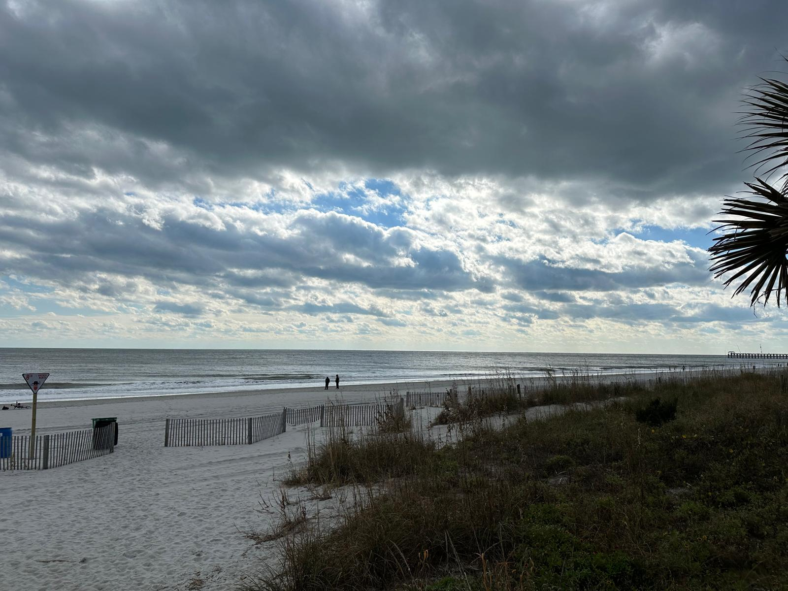
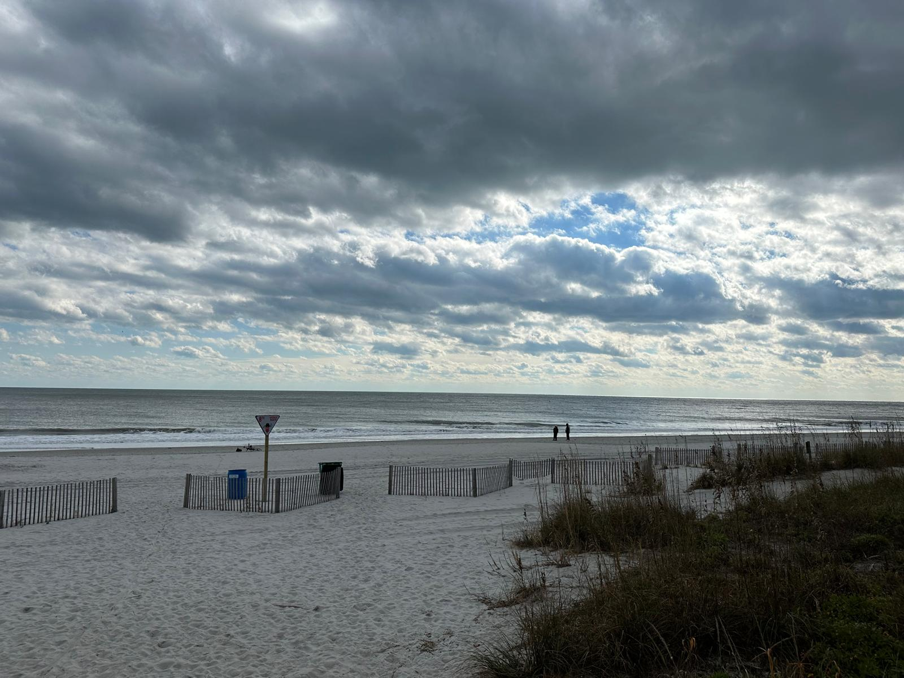
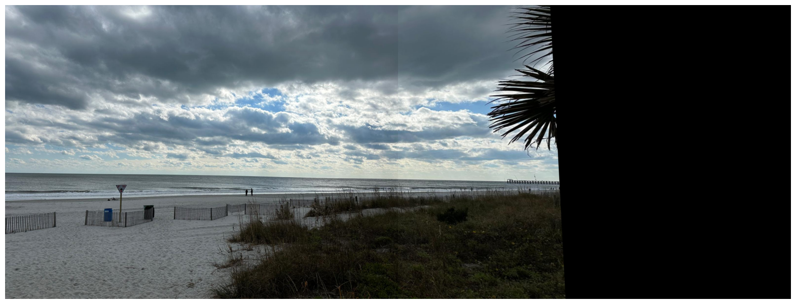

# Image Stitcher: Automated Panorama Creation

## Overview

This project implements an Image Stitching pipeline that takes multiple images as input and stitches them into a seamless panorama. The implementation leverages feature extraction techniques such as SIFT (Scale-Invariant Feature Transform) and feature matching algorithms to align and blend images accurately.


## Features

- Feature detection and matching using SIFT
- Homography estimation for image alignment
- Image warping and blending
- Supports multiple image inputs for panorama generation


## Installation
To run this project, install the required dependencies:

```bash

pip install opencv-python numpy matplotlib imageio


```

## Usage

1. Place the images you want to stitch in the project directory.
2. Run the Jupyter Notebook (stitch.ipynb) and follow the step-by-step process.
3. The final stitched image will be displayed and saved in the output folder.

## Example Output

Input Images:




Stitched Panorama:


